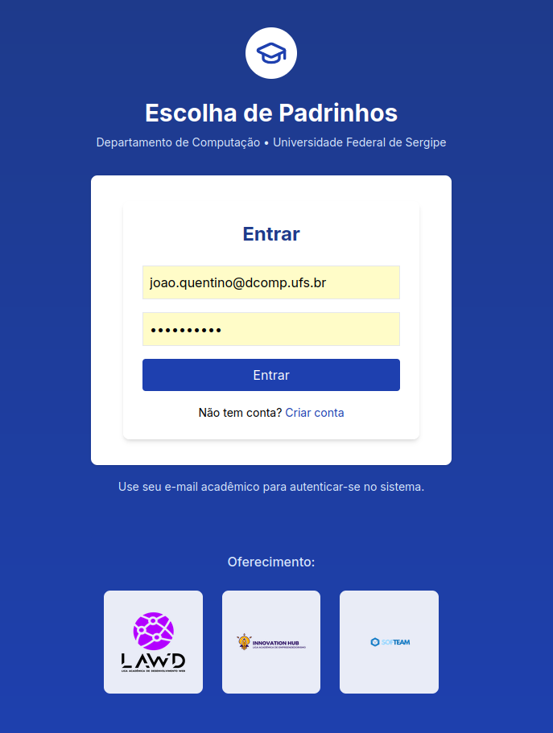
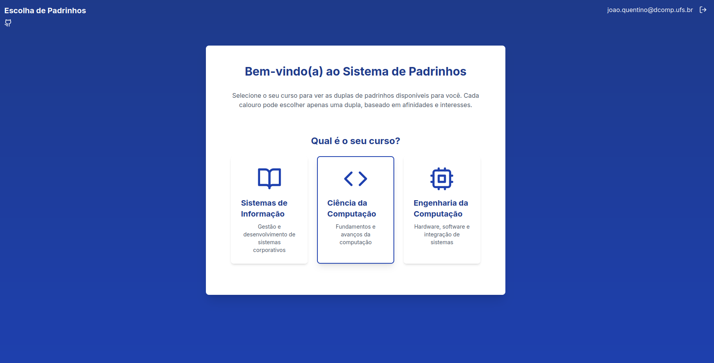
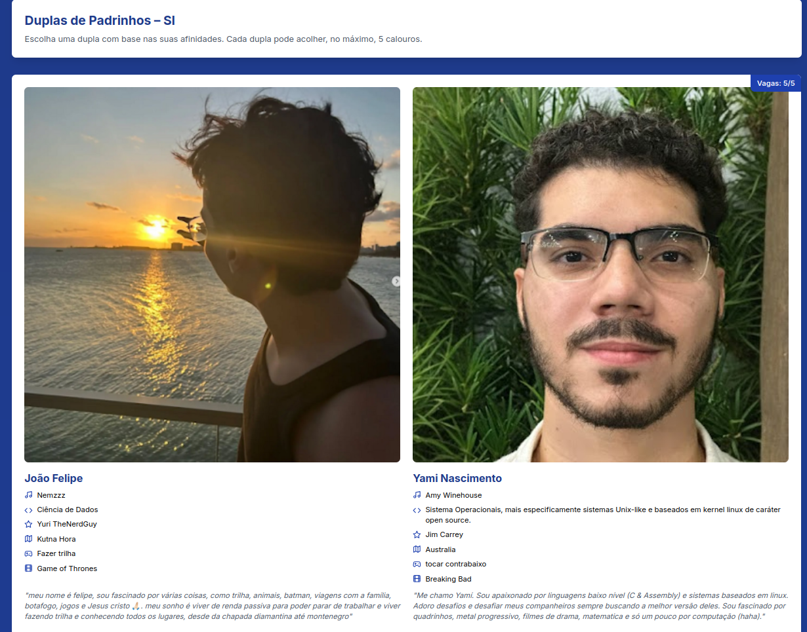
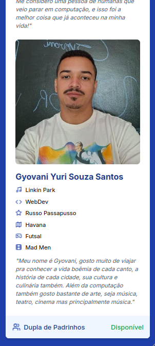

# Sistema de Escolha de Padrinhos - DComp UFS

Sistema web para facilitar a escolha de padrinhos/madrinhas por calouros dos cursos de computação da UFS (Universidade Federal de Sergipe).

## 🎯 Funcionalidades

- Autenticação via email institucional (@dcomp.ufs.br)
- Seleção do curso (SI, CC ou EC)
- Visualização de duplas de padrinhos disponíveis
- Sistema de vagas limitadas por dupla (máx. 5 calouros)
- Integração com grupos do WhatsApp

## 🛠️ Tecnologias

- React + TypeScript
- Vite
- TailwindCSS
- Firebase Auth + Firebase Firestore
- Context API para gerenciamento de estado
- Papa Parse para parsing CSV

## 👥 Fluxo do Usuário

- Login com email @dcomp.ufs.br
- Seleção do curso (SI, CC, EC)
- Visualização das duplas disponíveis
- Escolha baseada em afinidades
- Confirmação e entrada no grupo do WhatsApp

## 📱 Screenshots

  

    
    
<em>Tela de Login com autenticação institucional</em>

  

  
  

    
    
<em>Seleção do curso do calouro</em>

  

  

    
    
<em>Lista de duplas de padrinhos disponíveis</em>

  

  

    
    
<em>Lista de duplas no mobile</em>

  

## 🤝 Contribuindo

- Faça o fork do projeto
- Crie uma branch para sua feature (git checkout -b feature/AmazingFeature)
- Commit suas mudanças (git commit -m 'Add some AmazingFeature')
- Push para a branch (git push origin feature/AmazingFeature)
- Abra um Pull Request

## 📝 Licença

Este projeto está sob a licença MIT. Veja o arquivo LICENSE para mais detalhes.

## 👏Idealizadores do projeto

- LAWD (Liga Acadêmica de Desenvolvimento Web)
- Innovation Hub (Liga Acadêmica de Empreendedorismo)
- SofTeam (Empresa Júnior do DCOMP)
